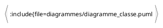
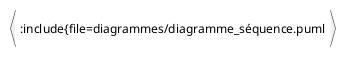
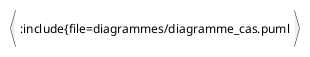
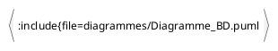
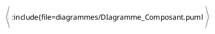

# Projet_Location_Propriété


## Details du projet

Noms des membres :
    - Jeff Moulin-Thorn
    - Fahim Khan

Nom du projet :
    - Location propriété

Enseignant :
    - Keven Chaussé

## Cloner le projet

Pour cloner le projet en https :
```
https://git.dti.crosemont.quebec/jmoulinthorn/projet_location_propriete.git
``` 
Pour cloner le projet en SSH :
```
git@git.dti.crosemont.quebec:jmoulinthorn/projet_location_propriete.git
```
```
git remote add origin https://git.dti.crosemont.quebec/jmoulinthorn/projet_location_propriete.git
```
## Instruction importante

- Le port utilisé pour le base de donnée est : 3308
- Paramètres de connexion : 
    utilisateur: root
    mots de passe: root
- commandes importantes :
```
docker compose up
```
```
pytest -vv .\tests\routers_locations.py
```

## Description de la problématique

De nombreux propriétaires possèdent des propriété qu’ils n’utilisent pas en permanence.
Afin d’éviter que leur bien reste inoccupé et pour en tirer un revenu, ils choisissent de le louer.
Cette solution leur permet d’obtenir des revenus réguliers, de couvrir les frais liés à la propriété.

## Description du projet de développement 

L'objectif principal est de créer un lien entre les propriétaires souhaitant maximiser le rendement de leur propriété et 
les clients potentiels à la recherche d'un logement temporaire ou de longue durée.

L'API devra notamment avoir:

  -L'ajout, la modification et la suppression des données avec Postman. <br/>
  -Test fonctionnel avec Pytest. <br/>
  -Une BD pour stocker toutes nos données. <br/>
  -Un backend pour faire des liens avec nos données et Postman avec Python.

## Personas et récits utilisateurs


### Client

<p align="center">

  
 
</p>

### Proptiétaire


<p align="center">
  
</p>


### Admin


<p align="center">
  
</p>


## Description de l’authentification et des droits d’accès 

Utilisateur Non identifié: <br/>
        -Accès limité, peut consulter, mais ne peut pas créer, modifier ou supprimer une location sans s'identifier.

Client: <br/>
        -Peut créer, modifier ou supprimer une ou ses propres locations.

Propriétaire:<br/>
        -Peut voir tous les clients qu'il a dans ses propriétés. <br/>
        -Peut modifier ou supprimer les demandes de réservation des clients qui sont dans ses propriétés.

Admin:<br/>
       -Peut voir tous les clients du propriétaires.<br/>
       -Peut modifier ou supprimer les clients du propriétaire.<br/>
       -Peut modifier ou supprimer les propriétaires.<br/>
       -Peut tout faire.
      
## PlantUML et diagrammes


### Diagramme de classe 



### Diagramme de séquence 




### Diagramme de cas 



### Diagramme de BD 



### Diagramme des composants de l’architecture



## Sprints et échéancier

    Sprint 1 : 29 septembre 2025 – 10 %
    · Créez un projet GitLab
    · Partagez votre projet avec vos enseignants
    · Documentez votre projet dans GitLab à l’aide des billets et du fichier README
    · Créez vos diagrammes à l’aide de PlantUML, archivez-les dans votre dépôt Git et intégrez-les à votre documentation dans GitLab
    · Créez des billets pour vos personas et vos récits utilisateurs
    · Créez un simulateur dans Postman
    · Partagez votre simulateur avec vos enseignants

    Sprint 2 : **